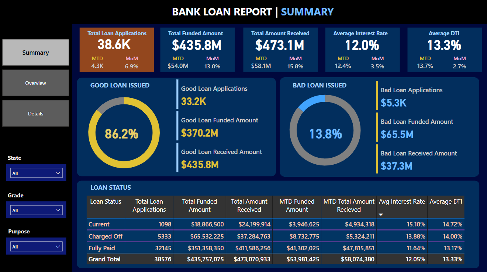
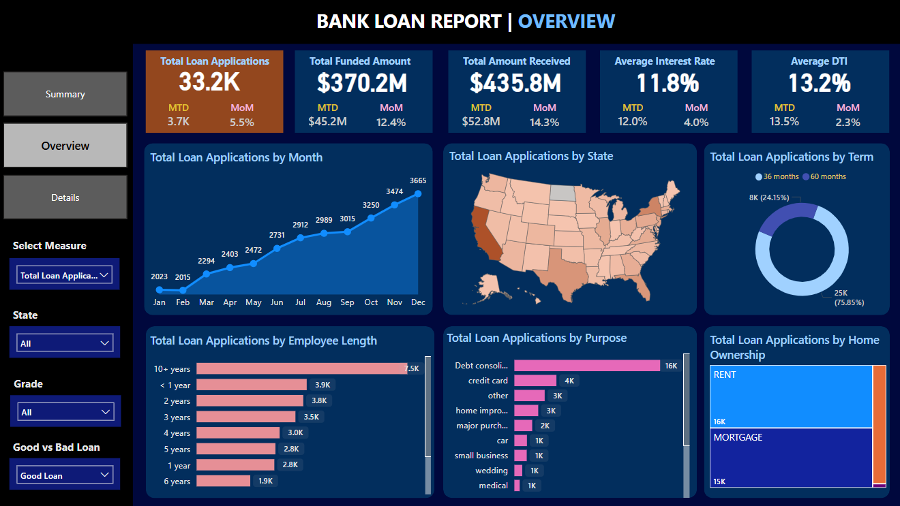
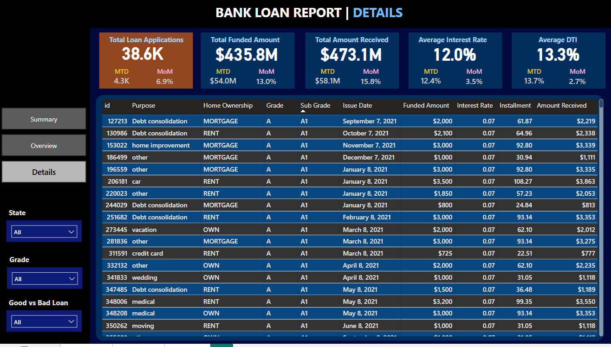

# Bank Loan Application Dashboard

## 📚 Project Overview

This project analyzes a bank's loan application dataset using SQL queries for data extraction and aggregation, and Power BI for creating dynamic and interactive dashboards.  
The objective was to extract key performance indicators (KPIs), visualize critical metrics, and deliver actionable business insights for financial decision-making.

---

## 🛠️ Tools and Technologies Used

- **SQL Server**: Data extraction, data aggregation, and KPI generation
- **Power BI**: Dashboard development, interactive data visualization
- **Microsoft Excel**: Minor data validation and manual data checks

---

## 🗄️ Data Preparation and SQL Queries

The raw loan application data was stored in a table named `bank_loan_data`.  
Using SQL, I extracted and aggregated the data into key performance metrics including:

- Total Loan Applications
- Funded Loan Amounts (Total, MTD, PMTD)
- Received Loan Amounts (Total, MTD, PMTD)
- Average Interest Rates
- Average Debt-to-Income Ratios (DTI)
- Good Loan and Bad Loan Percentages
- Loan Status Breakdown
- Trends by Month, State, Loan Term, Purpose, and Home Ownership

The cleaned and aggregated output was fed into Power BI for visualization.

---

## 📊 Power BI Dashboard Development

The final report was structured into **three detailed dashboards**:

---

### 🔵 1. Summary Dashboard

- High-level overview of critical KPIs:
  - Total Loan Applications
  - Funded Amounts
  - Received Payments
  - Average Interest Rate
  - Average DTI
- Snapshot performance with MTD vs PMTD comparisons.

---

### 🔵 2. Overview Dashboard

- Loan status distribution (Fully Paid, Current, Charged Off)
- Good Loan vs Bad Loan metrics
- Funded and Received Amounts by Loan Status
- Average Interest Rate and DTI across loan categories
- Monthly trends for applications, funded amounts, and received payments

---

### 🔵 3. Details Dashboard

- Detailed breakdown by:
  - State
  - Loan Term (36 months, 60 months)
  - Purpose of Loan (e.g., Debt Consolidation, Credit Card, Home Improvement)
  - Home Ownership Status (Rent, Own, Mortgage)
- Drill-down capabilities and slicers for dynamic exploration

---

## 📈 Key Metrics (KPIs) Tracked

- Total Loan Applications
- Funded Loan Amount (Total, MTD, PMTD)
- Received Loan Amount (Total, MTD, PMTD)
- Average Interest Rate (Overall, MTD, PMTD)
- Average Debt-to-Income Ratio (Overall, MTD, PMTD)
- Good Loan and Bad Loan Percentage
- Loan Status breakdown by category
- Trends by Month, State, Purpose, Term, and Home Ownership

---

## 📂 How to Navigate This Project

- Review the SQL queries in `Loan_Application_SQL_Queries.docx` to understand data extraction and aggregation logic.
- Open the Power BI file `AmanBenare_FinalProject.pbix` to interact with the dashboards, slicers, and dynamic KPIs.

---

## 📚 Key Learnings and Project Impact

- Mastered SQL query writing for KPI generation, monthly comparisons, and aggregation.
- Gained practical experience in Power BI dashboard development and storytelling.
- Applied advanced data visualization techniques for financial and operational KPIs.
- Delivered a business-ready reporting system that supports operational decision-making and financial strategy.

---

## 🚀 Thank you for viewing this project!

Feel free to explore the files and connect with me on [LinkedIn](https://www.linkedin.com/in/aman-benare-7801701bb/).
